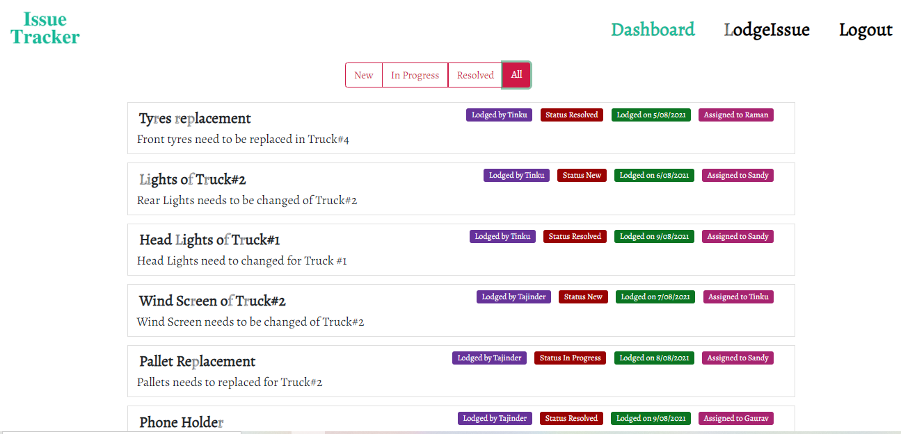
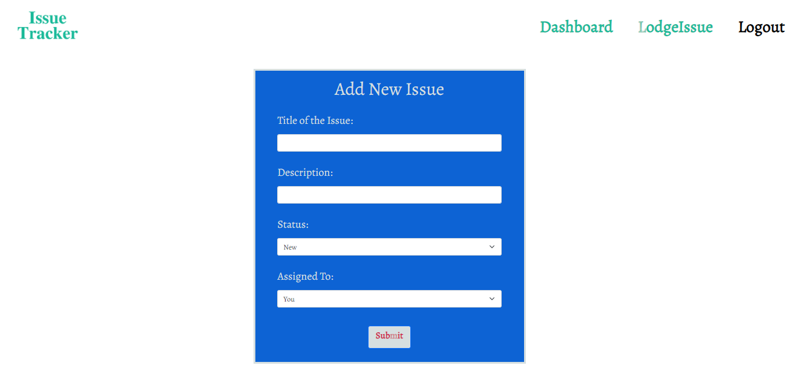
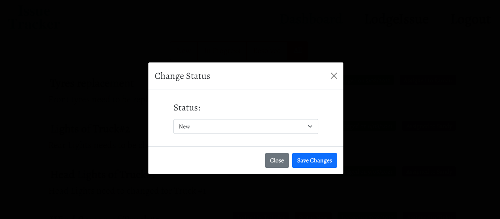
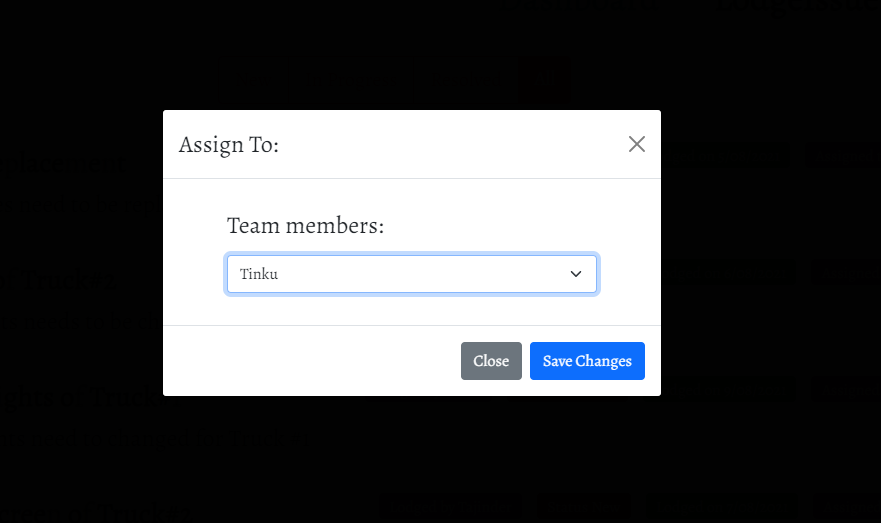
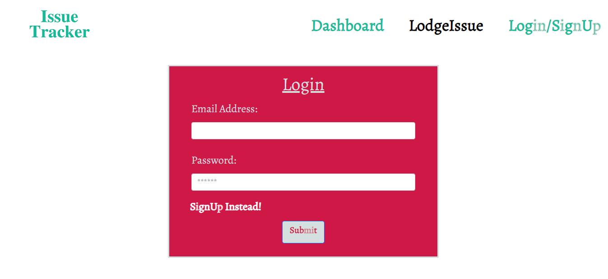
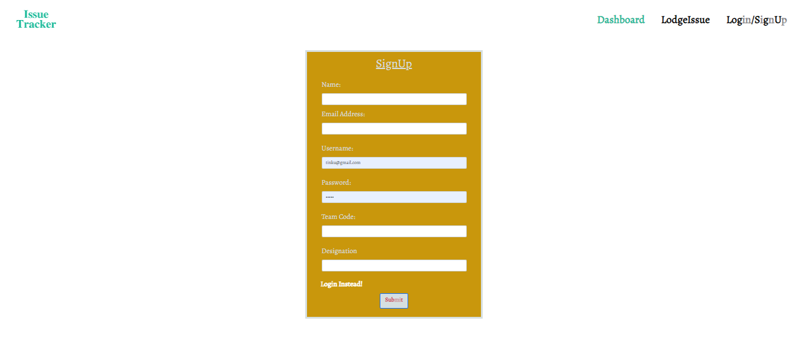

# Issue Tracker

## About The Project :

`Issue Tracker is a MERN stack application where users can track issues of their organization. Users can build their own team, report issues, assign those issues to their team members, update the status of issues as New, In-Progress and Resolved, re-assign those issues to someone else. Users can view the issues of their team, on the basis of the issue's status.`

## Table of Contents

- [Link of the website](#link-of-the-website)
- [Features](#features)
- [Technologies Used](#technologies-used)
- [Application Previews](#application-previews)
- [License](#license)
- [Got Any Questions](#got-any-questions)

## Link of the website:

https://track-your-issues.herokuapp.com/

## Features

This application has the following features:

- Application's homepage includes option to view Dashboard, add New Issue and login/signup.
- Once loggedIn, User is redirected to dashboard.
- User can add a new Issue, which includes title and description of issue, status of the issue and can assign it to someone in his team.
- On Dashboard, user can view Issue according to status of the issues.
- User can also reassign those issues and can change the status of issue.

## Technologies Used:

- MERN
- Graphql
- JWT
- JavaScript
- Node.js
- Express.js
- npm
- MongoDb
- Mongoose
- HTML
- CSS
- Bootstrap

## Application Previews:

## Got Any Questions

Feel free to reach me through
tinkubansal21@gmail.com

## License

Licensed under the [MIT](https://github.com/tinkubansal95/issue-tracker/blob/main/LICENSE) license.

---

© 2021
